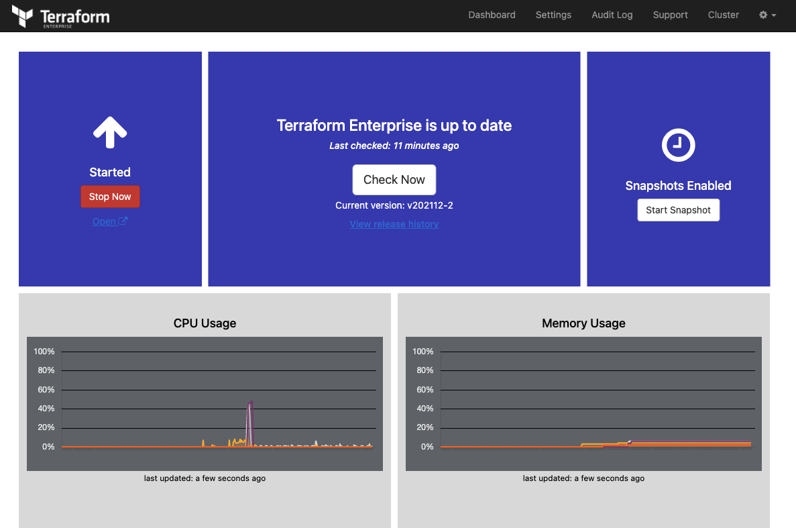

# TFE_demo_self_signed_certificate

This repository does an automated installation of TFE (Terraform Enterprise) on an Ubuntu virtual machine. 

This repository is based on the official HashiCorp documentation. [See documentation](https://www.terraform.io/enterprise/install/automated/automating-the-installer)


This repo uses Vagrant to create a virtual machine.

Vagrant virtual machine:
- ubuntu virtual machine starts
- TLS/SSL self-signed certificates will be created and stored under ```/vagrant/certificates```
- TFE settings file will be created under ```/vagrant/config/tfe_settings.json```
- Replicated configuration file will be create under ```/etc/replicated.conf```
- TFE installation script will be downloaded and executed
- the first admin user will be created within TFE to use with settings created under ```/vagrant/config/create_tfe_user.json```

For a manual installation of TFE follow [this documentation](manual/README.md) 

## Vagrant
Vagrant [See documentation](https://www.vagrantup.com/docs/installation)  
Virtualbox [See documentation](https://www.virtualbox.org/wiki/Downloads)

## License
- Make sure you have TFE license available for use

# How to
- Clone the repository to your local machine
```
git clone https://github.com/munnep/TFE_demo_self_signed_certificate.git
```
- Go to the directory
```
cd TFE_demo_self_signed_certificate
```
- save the license file as ```config/license.rli```
- Start a virtual machine with Vagrant (duration 10 minutes)
```
vagrant up
```
- You should see the following message when Vagrant has started the Virtual machine
```
    default: #              TFE installation complete              #
    default: # TFE dashboard: https://192.168.56.33.nip.io:8800    #
    default: # TFE Application: https://192.168.56.33.nip.io       #
    default: #######################################################
```
- Because you created self-signed certificates you should import them into your system to be able to connect to the website.  
Import the file ```certificates/ca.crt```      
MacOS example:
```
sudo security add-trusted-cert -d -r trustRoot -k "/Library/Keychains/System.keychain" certificates/ca.crt
```
- login to the replicated console page
[https://192.168.56.33.nip.io:8800](https://192.168.56.33.nip.io:8800)
- Unlock the console with the password ```Password#1```
- You should see that everything is started.
  
- Click on the open link which should point you to the TFE application [https://192.168.56.33.nip.io](https://192.168.56.33.nip.io)  
- login using the created account
```
user: admin
password: Password#1
```
- Stop the vagrant machine
```
vagrant halt
```
- When you are completely done you can remove it
```
vagrant destroy
```


# Done
- [x] Vagrant box
- [x] Generate TLS self-signed certificates
- [x] generate terraform settings.json file
- [x] generate replicated.conf file
- [x] terraform installation script
- [x] First user automation

# To do  
