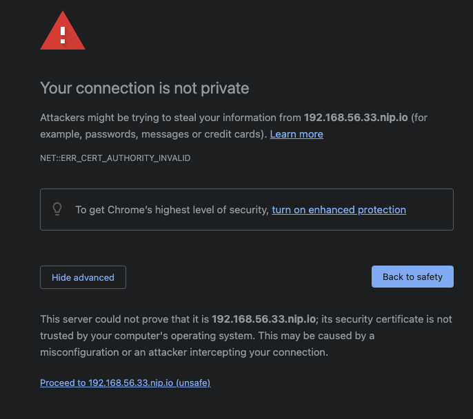
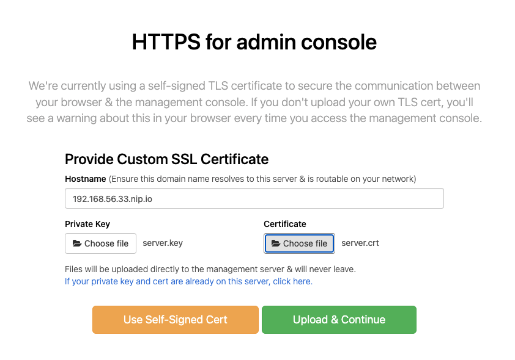
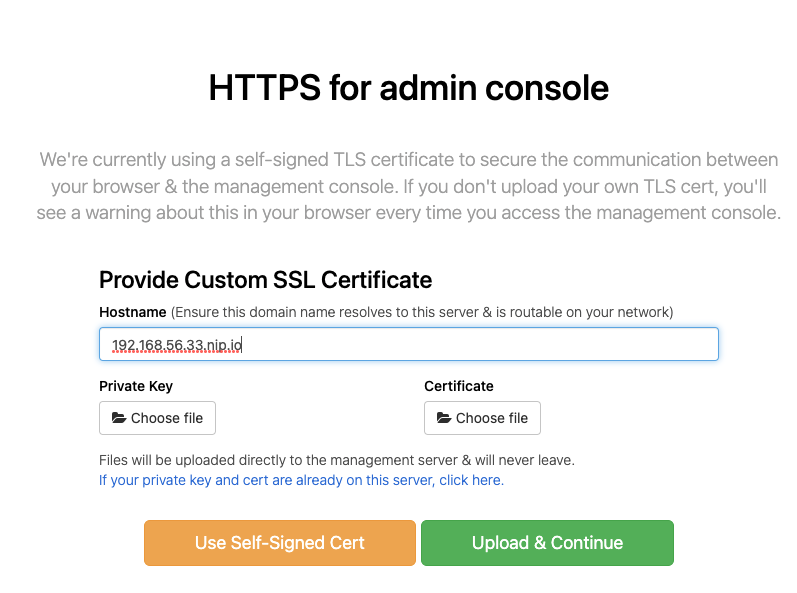
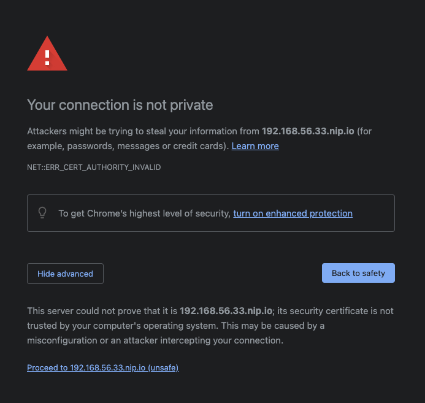
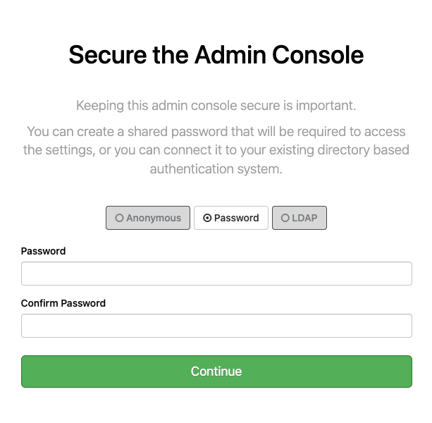
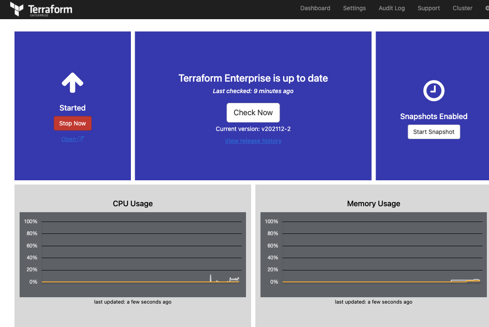

# manual installation TFE demo with self signed certificates

# How to

- Start the Vagrant box on which we we will install TFE
```
vagrant up
```
- login to the Vagrant box
```
vagrant ssh
```
- create the self signed certificates we will be using later
```
touch /home/vagrant/.rnd

cd /vagrant/certificates
openssl genrsa -out ca.key 2048
openssl req -new -x509 -days 365 -key ca.key -subj "/C=CN/ST=GD/L=SZ/O=Acme, Inc./CN=Acme Root CA" -out ca.crt

openssl req -newkey rsa:2048 -nodes -keyout server.key -subj "/C=CN/ST=GD/L=SZ/O=Acme, Inc./CN=192.168.56.33.nip.io" -out server.csr
openssl x509 -req -extfile <(printf "subjectAltName=DNS:192.168.56.33.nip.io") -days 365 -in server.csr -CA ca.crt -CAkey ca.key -CAcreateserial -out server.crt

sudo cp /vagrant/certificates/ca.crt /etc/ssl/certs/
sudo cp /vagrant/certificates/server.crt /etc/ssl/certs/
sudo update-ca-certificates --fresh
```
- Download the installation script
```
cd 
curl https://install.terraform.io/ptfe/stable > install.sh
```
- Run the installation script
```
sudo bash install.sh
```
- For the private ip address choose ```1```
```
Determining local address
The installer was unable to automatically detect the private IP address of this machine.
Please choose one of the following network interfaces:
[0] enp0s3	10.0.2.15
[1] enp0s8	192.168.56.33
Enter desired number (0-1): 1
```
- service IP address can be blank
```
Determining service address
The installer was unable to automatically detect the service IP address of this machine.
Please enter the address or leave blank for unspecified.
Service IP address: 
```
- No need for a proxy
```
Does this machine require a proxy to access the Internet? (y/N)
```
- Docker and all other things will be downloaded and installed
```
Operator installation successful

To continue the installation, visit the following URL in your browser:

  http://<this_server_address>:8800
```
- In a webbrowser go to the following link ```http://192.168.56.33.nip.io:8800```
- Click Continue to Setup  
    
- click advanced and ```proceed to 192.168.56.33.nip.io```  
  
- upload the TLS certificates created earlier  

- when you reload you may get a warning the certificate isn't valid. Make an exception in the browser for the certificate so it will continue
  
  
- Use Self-Signed Cert
  
- Proceed to website
  
- Upload the license file to use
  
- online installation
  
- Choose password ```Password#1```
  
- Preflight Checks should be good
  
- Settings 
    - Hostname: ```192.168.56.33.nip.io```
    - Encryption password: ```Password#1```
    - click save
- On the dashboard you should see the Terraform is up and running and the link with open
  
- create a first account which will be the admin account
  
- create your organization
  
- create a workspace if you want to