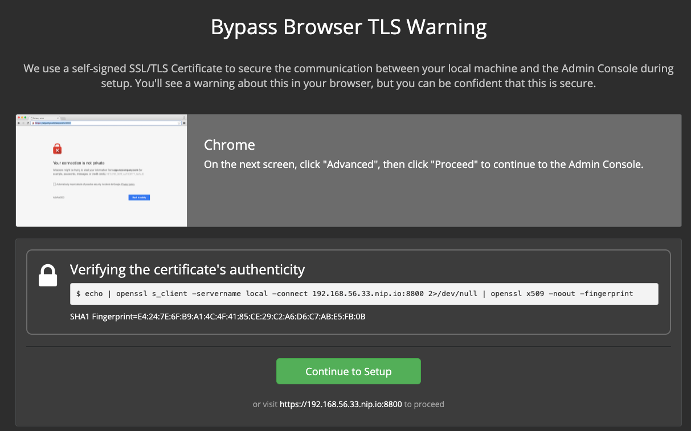
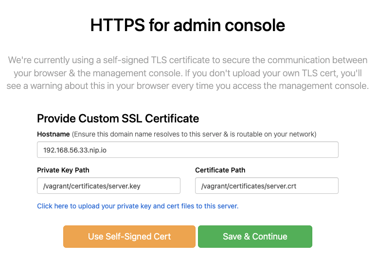
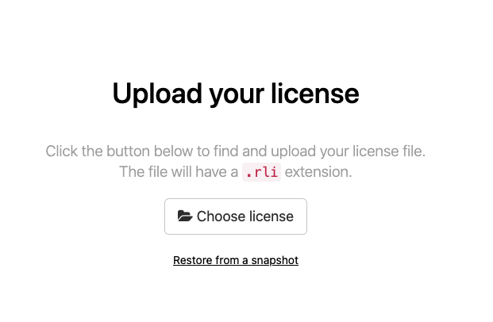
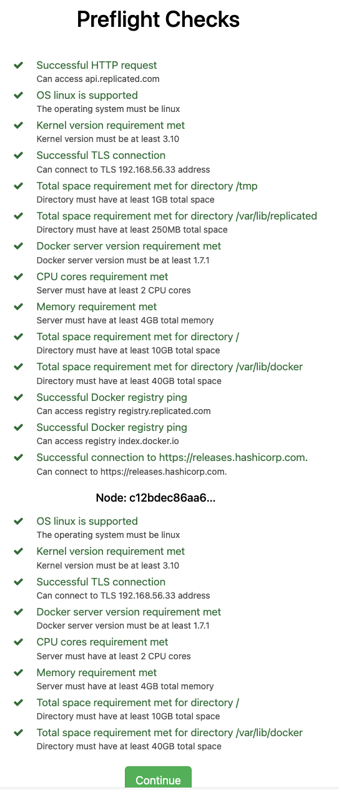

# manual installation TFE demo with self signed certificates

This manual describes how to manually install TFE (Terraform Enterprise) with self-signed certificates

For the official documentation [see this link](https://www.terraform.io/enterprise/install/interactive/installer)

Steps involved:
- Start an ubuntu machine with Vagrant in Virtualbox
- Create self-signed certificates to use with TFE
- Install TFE
- Configure TFE basics

# Prerequisites

## Vagrant
Vagrant [See documentation](https://www.vagrantup.com/docs/installation)  
Virtualbox [See documentation](https://www.virtualbox.org/wiki/Downloads)


# How to

- Start the Vagrant box on which we we will install TFE
```
vagrant up
```
- login to the Vagrant box
```
vagrant ssh
```
- create the self signed certificates we will be using later
```bash
touch /home/vagrant/.rnd

cd /vagrant/certificates
openssl genrsa -out ca.key 2048
openssl req -new -x509 -days 365 -key ca.key -subj "/C=CN/ST=GD/L=SZ/O=Acme, Inc./CN=Acme Root CA" -out ca.crt

openssl req -newkey rsa:2048 -nodes -keyout server.key -subj "/C=CN/ST=GD/L=SZ/O=Acme, Inc./CN=192.168.56.33.nip.io" -out server.csr
openssl x509 -req -extfile <(printf "subjectAltName=DNS:192.168.56.33.nip.io") -days 365 -in server.csr -CA ca.crt -CAkey ca.key -CAcreateserial -out server.crt

sudo cp /vagrant/certificates/ca.crt /etc/ssl/certs/
sudo cp /vagrant/certificates/server.crt /etc/ssl/certs/
sudo update-ca-certificates --fresh
```
- Download and run the installation script
```
curl https://install.terraform.io/ptfe/stable | sudo bash
```
- For the private ip address choose ```1```
```
Determining local address
The installer was unable to automatically detect the private IP address of this machine.
Please choose one of the following network interfaces:
[0] enp0s3	10.0.2.15
[1] enp0s8	192.168.56.33
Enter desired number (0-1): 1
```
- service IP address can be blank
```
Determining service address
The installer was unable to automatically detect the service IP address of this machine.
Please enter the address or leave blank for unspecified.
Service IP address: 
```
- No need for a proxy ```N```
```
Does this machine require a proxy to access the Internet? (y/N)
```
- Docker and all other things will be downloaded and installed
```
Operator installation successful

To continue the installation, visit the following URL in your browser:

  http://<this_server_address>:8800
```
- In a webbrowser go to the following link ```http://192.168.56.33.nip.io:8800```
- Click Continue to Setup  
    
- click advanced and ```proceed to 192.168.56.33.nip.io```  
  
- Configure the HTTPS for admin console with the following settings
    - hostname: ```192.168.56.33.nip.io```
    - Click on the link ```If your private key and cert are already on this server, click here.```
    - Private key path: ```/vagrant/certificates/server.key```
    - Certificate path: ```/vagrant/certificates/server.crt```   
  
- When you reload you may get a warning the certificate isn't valid. Add the self-signed root certificate ```certifcates/ca.crt``` as trusted on your machine.
- When you added the root certificate to your machine reload the page. 
- Upload your license ```<name>.rli```  
    
- Choose ```Online``` installation and click Continue  
    
- Choose password ```Password#1```  
    
- Preflight Checks should be good  
    
- You will get on the ```Settings``` page. Configure the below chapters   
    - Hostname: ```192.168.56.33.nip.io```  
    - Encryption password: ```Password#1```  
    - Installation Type: ```Demo```
    - click ```save``` at the bottom of the page 
- On the dashboard you should see the Terraform is up and running and the link with open . This takes around 5 minutes to finish
    
- create a first account which will be the admin account  
    
- create your organization  
    
- You have a running TFE environment which you can use 